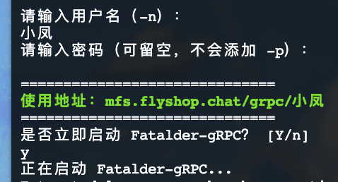
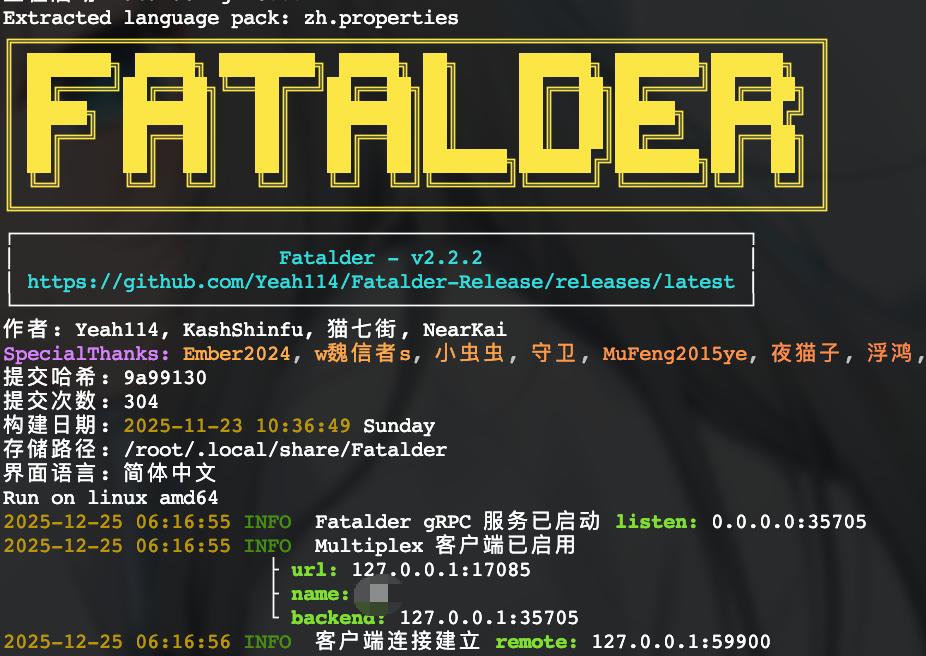

---
# 必需字段
title: "Fatalder-FFF (UI版本)使用教程"                # 【必需】文章标题，用于页面标题和文章显示
description: "易用、灵活、快捷"          # 【必需】文章描述，用于SEO和文章摘要

# 发布相关
published: 2025-12-24          # 文章发布日期，格式为YYYY-MM-DD
date: 2025-01-20               # 文章创建日期，用于内部排序
draft: false                   # 是否为草稿，true=草稿（不公开），false=正式发布
permalink: "fatalder-ui"        # 固定链接，自定义文章URL路径

# 内容分类
tags: [Fatalder, 教程, 导入器, UI]           # 文章标签数组，用于标记文章主题
category: "Fatalder"           # 文章分类，用于组织文章
pinned: true                   # 是否置顶，true=置顶显示在列表前面

# 作者信息
author: "天劫飛飛"             # 文章作者姓名

# 图片设置
image: "./fatalder-ui.jpg"          # 文章封面图片路径
---

## Fatalder-FFF 是什么？

Fatalder-FFF 是 **Fatalder 的图形界面版本**，旨在提供更直观、便捷的操作体验。其设计目标可概括为三个“F”：

- **易用（Facile）**
- **灵活（Flexible）**
- **快捷（Fast）**

> **当前支持平台**：目前仅支持安卓系统，macOS 与 Windows 版本正在适配中，敬请期待。

---

## 使用教程

### 第一步：下载软件

1. 点击此链接加入 QQ 群 **185706357**：  
   [https://qm.qq.com/q/9ln2BgyaHe](https://qm.qq.com/q/9ln2BgyaHe)

2. 进入群文件，找到并下载 **Fatalder-FFF (UI版本)** 的安装文件。  
   

### 第二步：启动与登录

1. 在您的服务器上运行 Fatalder-UI 实例（请注意：此处指的是 MCSM 面板上的服务端程序，而非刚刚下载的 APP）。

2. 首次启动时，按提示输入用户名及密码。  
   > 提示：密码为可选设置，如无需可留空。  
   

3. 设置完成后，系统将显示您的服务访问地址。请确认并输入 **Y** 以启动 Fatalder-gRPC。当看到如下界面时，说明服务已成功运行：  
   

### 第三步：配置客户端

1. 打开已安装的 **Fatalder-FFF** 应用。  
   

2. 进入 **配置 gRPC** 页面，填入上一步获取的服务地址。

3. 之后依次进行 **测试连接**，配置 **API-Key** 后，即可开始使用。

---

进入软件后的操作简单易懂,就不做过多讲解。